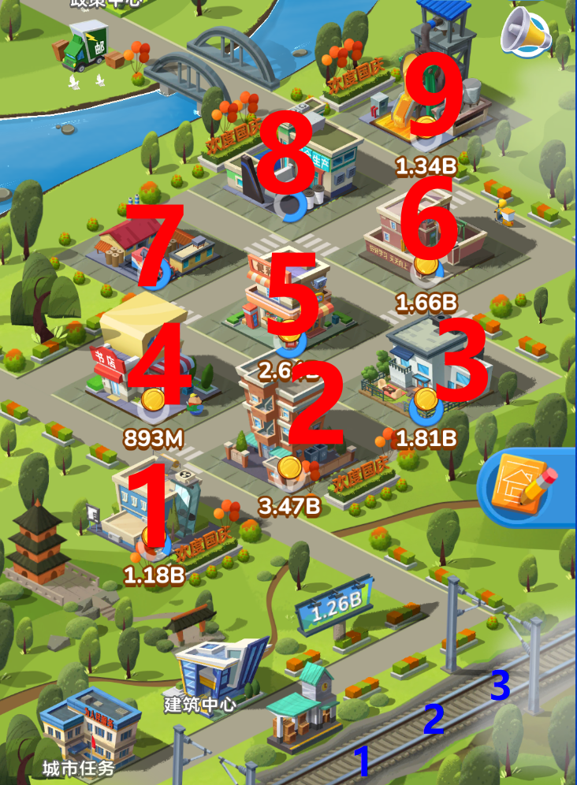

# 家国梦自动化脚本

## 功能：

- 自动**收金币**
- 自动**移动货物**
- 自动**升级**
- 自动**签到领奖励**

## 思路：

- 获取货物的绝对位置（蓝色1，2，3数字），截取60*60的货物图片，与货物模板**计算相似度**（颜色直方图），从而判断货物类别，接着移动到对应建筑（红色1~9数字）
- 需要自己在cfg.py更改**货物和建筑物的映射关系**





## 增加新货物：

- 运行add_goods.py，会在img/roi目录下生成很多货物图片
- 选取新的货物图片移动到tpl目录下，并重命名
- 在cfg.py目录更改**货物和建筑物的映射关系**

## 操作指南

> ```python
> # 安装依赖
> python -m pip install uiautomator2 opencv-python
> # 或者
> pip install -r requirements.txt
> 
> # adb 连接
> # 使用 MuMu 模拟器，确保屏幕大小为 1920（长） * 1080（宽）
> adb connect 127.0.0.1:7555
> 
> # 获取 device 名称,并填写至 main.py
> adb devices
> 
> # 在已完成 adb 连接后，在手机安装 ATX 应用
> python -m uiautomator2 init
> 
> # 打开 ATX ，点击“启动 UIAutomator”选项，确保 UIAutomator 是运行的。
> 
> # 进入游戏页面，启动自动脚本。
> python main.py
> ```
> 引用[JGM-Automator](https://github.com/Jiahonzheng/JGM-Automator)

## 参考
[JGM-Automator](https://github.com/Jiahonzheng/JGM-Automator)